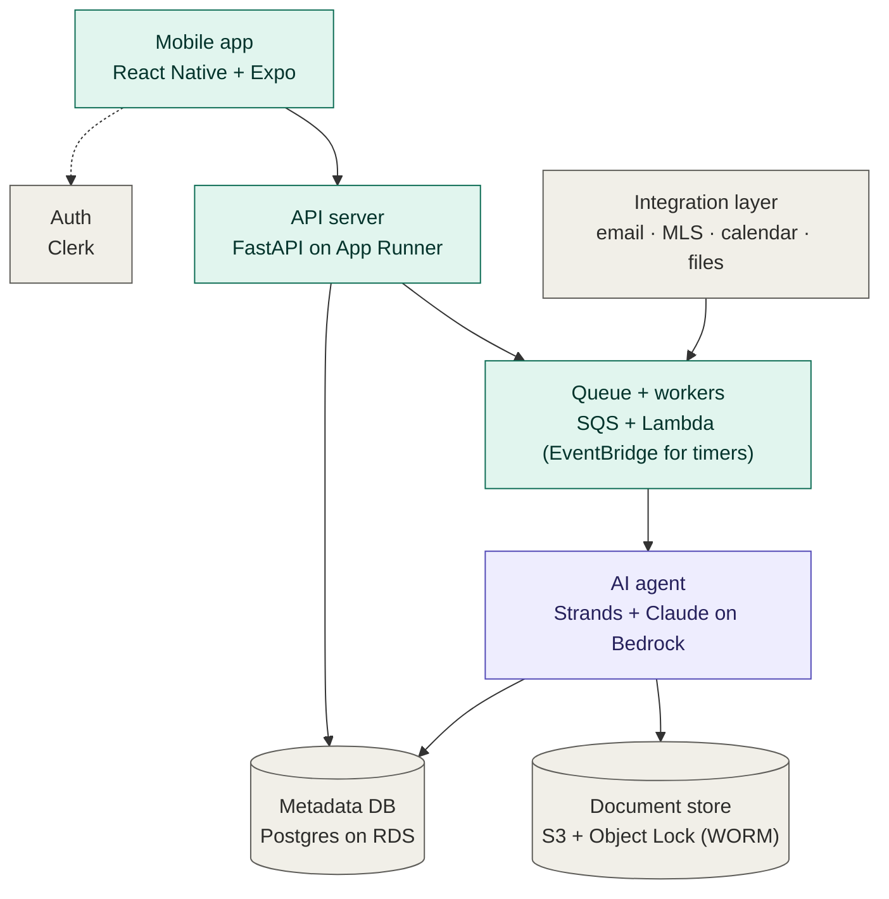
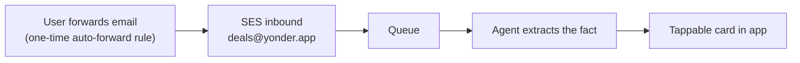

# Yonder — architecture sketch

Working name: **Yonder** (also floating: *homeward* / *homeward yonder*). Repo: `yonder`.

Quick bearings, not a spec. Lots still to work out — expect this to change.

## What it does

A consumer real-estate app that pulls the stuff you'd normally chase through
email and the MLS — strata docs, viewing bookings, subject-removal updates,
listing and sold data — and surfaces it as tappable cards in the app. The
agent does the reading so the user doesn't have to. Guiding principle: as
little typing as possible, ruthlessly.

## Target architecture

Teal = code you write · purple = the agent · gray = managed / external.

## Stack

- **Frontend:** React Native + Expo
- **Auth:** Clerk
- **API:** FastAPI on AWS App Runner (Python)
- **Async work:** SQS + Lambda workers; EventBridge for scheduled/timer jobs
- **Agent:** Strands SDK (a Python library, not a language) + Claude on Amazon
  Bedrock. Runs as a plain Python worker for now; adopt Bedrock AgentCore later
  if/when we need session isolation or long runs.
- **Documents:** S3 with Object Lock for WORM retention
- **Database:** Postgres on RDS (small instance for now); revisit Aurora
  Serverless v2 when traffic justifies it
- **Infra as code:** AWS CDK (write infra in Python; compiles to CloudFormation)
- **No Amplify**

## v1 prototype path — the email pipeline, no OAuth or fees

Start with **email forwarding**, not inbox reading:

- No OAuth, no Google restricted-scope verification, no $500/yr assessment, no
  per-account aggregator fees, no multi-provider code.
- The email/extraction half can start with zero MLS. But MLS is a **parallel
  track**, not a later add-on — much of the early experience needs property and
  listing data no email contains. Start the realtor/brokerage + board paperwork
  now: that access has a long lead time even if the code lands after the email
  pipeline.
- Proves the only part that really matters early: can the agent reliably extract
  facts from real strata docs and messy agent emails.

Graduate later to OAuth inbox reading (Gmail API / Microsoft Graph / IMAP) for
the seamless no-setup experience. MLS runs in parallel (IDX first, VOW for
sold/history), gated by the access paperwork more than by our code.

## Integration sources (pluggable, not settled)

- **Email:** forwarding → SES inbound for v1; native Gmail API + Microsoft Graph
  + IMAP via OAuth later (DIY, not a per-account aggregator).
- **MLS:** Repliers; needs a licensed realtor / brokerage partner. IDX to start,
  VOW (sold + historical) later. Parallel to email, not downstream of it — and
  the access paperwork is slow, so start it early.
- **Calendar:** Google / Outlook (output).
- **Files:** Dropbox / Google Drive.
- **Other** (BC Assessment, etc.): later.

## Core flow

1. An email (forwarded in v1, OAuth-pulled later), document, or listing event
   lands on the queue.
2. The agent reads it — including strata PDFs — and extracts the structured fact
   (a subject-removal date, a viewing time, a price change).
3. The app shows a tappable card. The original is locked in S3; the extracted
   data lives in Postgres.

## Biggest unknowns — validate these first

- **Email extraction quality.** Can the agent reliably pull dates and facts out
  of real strata docs and messy agent emails? This is the product; prototype it
  first, via forwarding, for free.
- **MLS / VOW access.** Needs a realtor/brokerage partner plus signed board
  contracts, and whether a partner's existing feed can legally power this app is
  an open licensing question. Parallel early track with a long lead time — start
  the board + Repliers conversation now, even while prototyping email.
- **Gmail restricted-scope verification.** Only relevant once we move from
  forwarding to OAuth inbox reading — deferred, not gone.
